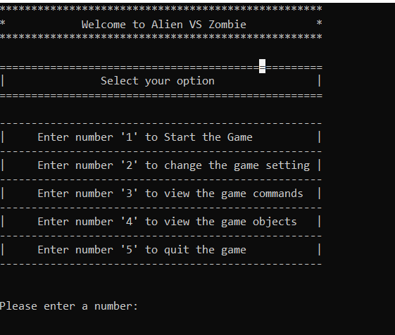
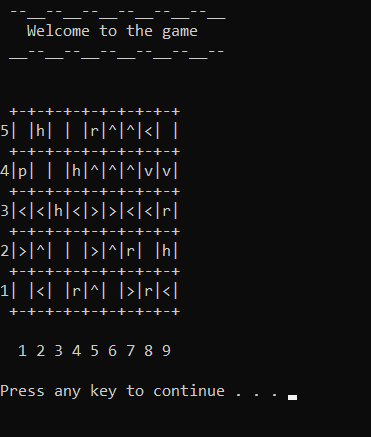

# Alien vs. Zombie

Alien vs Zombie is a turn-based combat game in which the player controls Alien to defeat a group of Zombies. Prior to the game, the player can customize settings including game board dimensions and number of zombies. The player can also save a game into a file and load from a file.

Please provide the YouTube link to your [Video Demo](https://youtube.com).

## Compilation Instructions

1. First, open a new terminal.
2. Select the file that contains the main.cpp file.
   (We already compile and build a C++ program into an executable program, the executable file name: "main.exe")
3. So, just type ".\main" run the file. :)
4. Play the game!

## User Manual

When the game starts, user can select whichever options they would want to. Users can learn how to play the game by reading the story in the "About" to quickly grasp the concept of the game eventhough it's their first time playing the game. After understanding the story of the game, user can look through the menu list and read what all the commands do. There will be descriptions beside the commands for users to get a idea of how the game works. User can also change the game settings to any dimension they like. After that, user can start the game and play it. When the user had all the fun playing the game, they can quit the game, and save it so that they can continue the game next time.

## Progress Log

- [Part 1](PART1.md)
- [Part 2](PART2.md)

## Contributors

Please replace the following with your group members' names.

- Tan Teng Hui
- Ho Teck Fung
- Au Ji Hin
